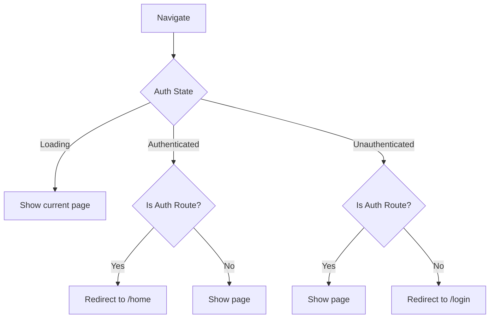

# Routing

The app uses [GoRouter](https://pub.dev/packages/go_router) with code generation via `go_router_builder`.

## Route Table

| Path | Route | Shell | Auth Required |
|------|-------|-------|---------------|
| `/home` | `HomeRoute` | Dashboard (bottom nav) | Yes |
| `/profile` | `ProfileRoute` | Dashboard (bottom nav) | Yes |
| `/settings` | `SettingsRoute` | Dashboard (bottom nav) | Yes |
| `/login` | `LoginRoute` | Auth (no nav) | No |
| `/signup` | `SignupRoute` | Auth (no nav) | No |
| `/forgot-password` | `ForgotPasswordRoute` | Auth (no nav) | No |

## Shell Structure

```
Root
├── DashboardShellRoute (StatefulShellRoute) — Bottom Navigation Bar
│   ├── Branch 0: /home
│   ├── Branch 1: /profile
│   └── Branch 2: /settings
└── AuthShellRoute — No shell UI
    ├── /login
    ├── /signup
    └── /forgot-password
```

## Auth Guard Flow



The auth redirect is handled in the `appRouterProvider` via GoRouter's `redirect` callback:

```dart
redirect: (context, state) {
  if (!isLoggedIn && !isAuthRoute) return '/login';
  if (isLoggedIn && isAuthRoute) return '/home';
  return null; // No redirect
}
```

## Bottom Navigation

The bottom navigation bar is a Material 3 `NavigationBar` with 3 destinations:
- **Home** (`Icons.home`)
- **Profile** (`Icons.person`)
- **Settings** (`Icons.settings`)

Each tab preserves its own navigation state via `StatefulShellRoute`.

## Typed Routes

Routes are defined as typed classes with `go_router_builder` annotations:

```dart
@TypedGoRoute<HomeRoute>(path: '/home')
class HomeRoute extends GoRouteData {
  const HomeRoute();

  @override
  Widget build(BuildContext context, GoRouterState state) {
    return const HomeScreen();
  }
}
```

Generated code is in `app_router.g.dart`.

## Navigating

```dart
// Using typed routes (recommended)
context.pushNamed('login');
const HomeRoute().go(context);

// Using path-based navigation
context.go('/home');
context.push('/settings');
```

## Adding a New Route

1. Create the screen widget
2. Add it to the route shell in `app_router.dart`:
   - Auth screens → add `TypedGoRoute` under `AuthShellRoute`
   - Dashboard screens → add to appropriate branch or create new branch
3. Run `./scripts/generate.sh` to regenerate `app_router.g.dart`
4. If added to bottom nav, add a `NavigationDestination`
5. Update this document
